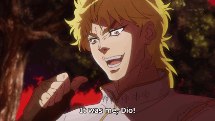
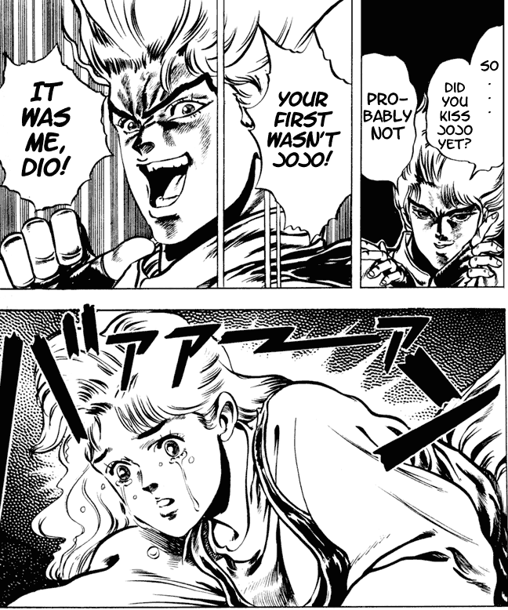
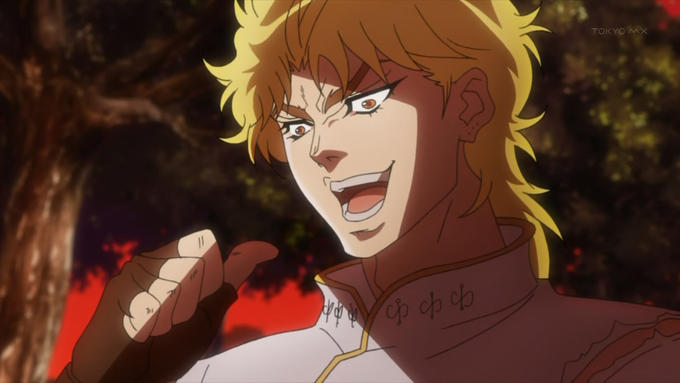
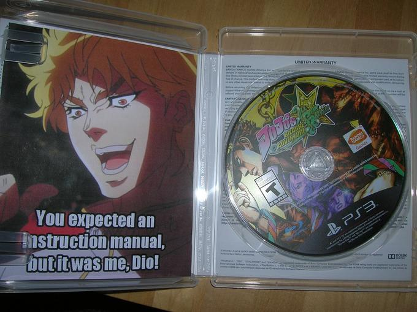

**You expected something important, but**

  
**"It Was Me, Dio!"** ("Kono Dio Da!" in Japanese) is a memorable quote from the Japanese manga [JoJo's Bizarre Adventure](https://en.wikipedia.org/wiki/JoJo%27s_Bizarre_Adventure) 
uttered by the main antagonist [Dio Brando]() to congratulate himself after stealing the first kiss from Erina Pendleton, the love interest of his rival and protagonist Jonathan "JoJo" Joestar.

### Origin

The quote originally appeared in a scene from the third and fourth chapters of 
**JoJo’s Bizarre Adventure: Phantom Blood**, 
the first story arc of the manga series published in 1987. 
In this scene, _Dio Brando_ forces _Erina Pendleton_ (Jonathan's only friend)
to kiss him in order to torment his rival after learning that _Erina_ and _Jonathan_ had spent the day together on a romantic date.
Immediately after kissing her, _Dio_ gloats about beating _Jonathan_ to her first kiss by saying: 
>Your first wasn’t JoJo! It was me, Dio!

However, the quote gained much of its traction through its inclusion in the pilot episode of the anime series,
which premiered in Japan on October 5th, 2012. 
On the day after the broadcast, the earliest known English-language discussion about the kissing scene and Dio's quote emerged
on 4chan's /a/ (anime & manga) board.
Since then, the screen capture of Dio saying the quote has appeared in a number of Jojo's Bizarre Adventure discussions on the site.

### Spread

On January 24th, 2013, a new thread was created in the /a/ board on 4chan with the screenshot and the "it was me, Dio!" quote,
which gathered more than 55 replies prior to being archived.
On April 28th, 2014, Tumblr user homealonethree posted the request "reblog if it was you, Dio," 
accumulating upwards of 4,100 notes in the next month. On May 2nd, Twitter user InazumaBuster posted
a photo of the JoJo's Bizarre Adventure: All Star Battle fighting game, with an image of Dio Brando substituted for the
instruction manual.
In the first two weeks, the post received over 870 retweets and 660 favorites. 
The image was subsequently posted to Tumblr by user Chains of Abyss.

